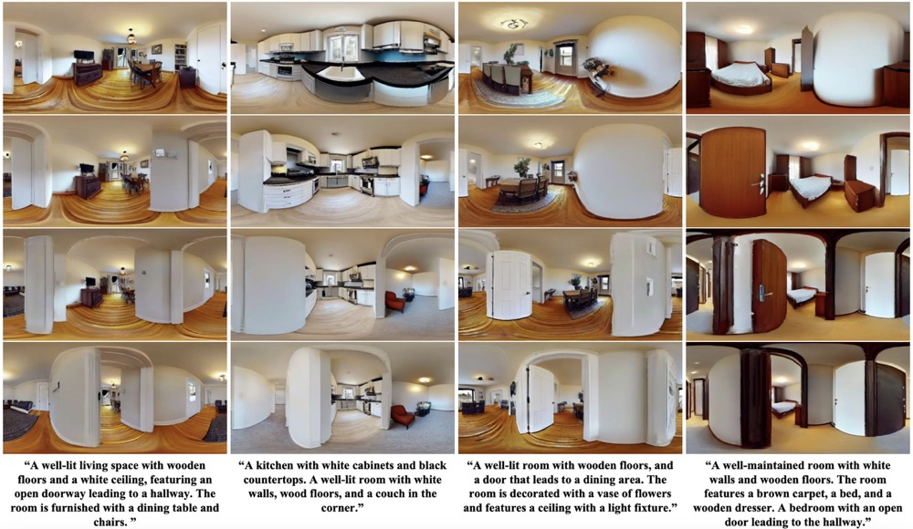
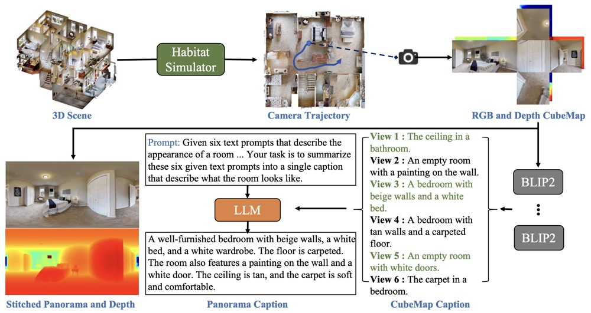
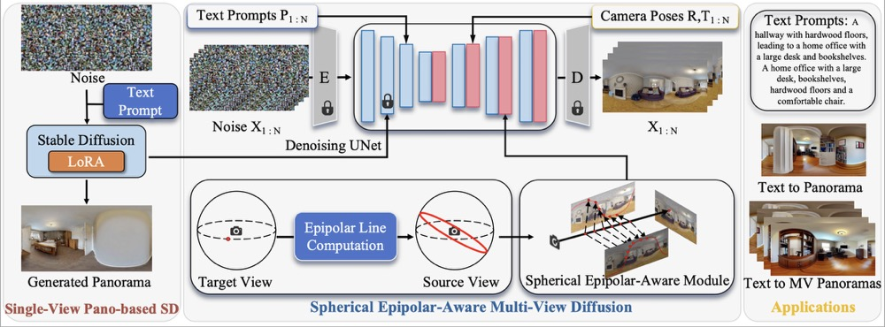
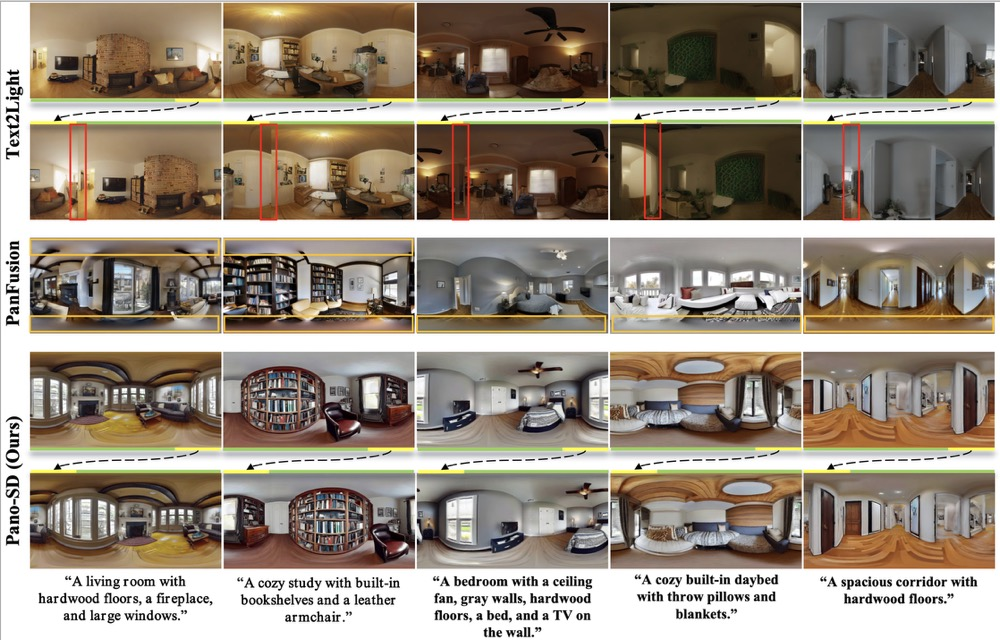
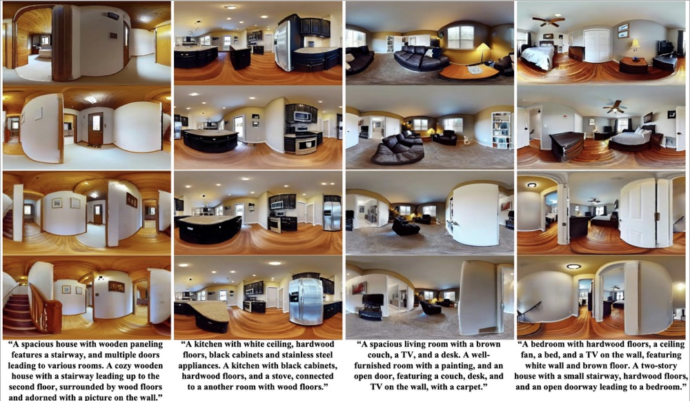
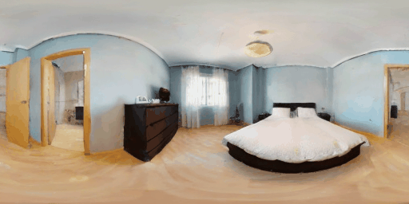

# DiffPano: Scalable and Consistent Text to Panorama Generation with Spherical Epipolar-Aware Diffusion
### [Project Page](https://zju3dv.github.io/DiffPano/) | [Paper]()
<!-- Code is coming soon. -->

<br/>

> 

> [Weicai Ye](https://ywcmaike.github.io/), Chenhao Ji,Zheng Chen, Junyao Gao, Xiaoshui Huang, Song-Hai Zhang, Wanli Ouyang, Tong He, Cairong Zhao, Guofeng Zhang

## Teaser

DiffPano allows scalable and consistent panorama generation (i.e. room switching) with given unseen text descriptions and camera poses. Each column represents the generated multi-view panoramas, switching from one room to another.

## Panoramic Video-Text Dataset Pipeline


## Framework


## Text to Single-View Panorama Generation



## Text to Multi-View Panorama Generation


## Text to Panoramic Video Generation



## Brewing🍺, code coming soon.
## Citation

If you find this code useful for your research, please use the following BibTeX entry.

```bibtex
@article{Ye2024DiffPano,
          title={DiffPano: Scalable and Consistent Text to Panorama Generation with Spherical Epipolar-Aware Diffusion},
          author={Weicai Ye and Chenhao Ji and Zheng Chen and Junyao Gao and Xiaoshui Huang and Song-Hai Zhang and Wanli Ouyang and Tong He and Cairong Zhao and Guofeng Zhang},
          booktitle={arxiv preprint},
          year={2024},
      }
      
```